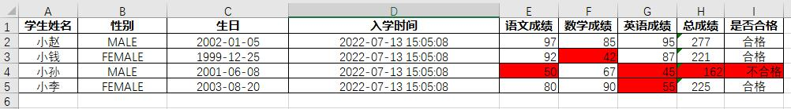

# excel-io

封装poi对Office Excel的输入输出工具，简化简单的导入和导出Excel数据的操作。（暂不支持合并单元格）

```xml
<dependency>
    <groupId>com.github.developframework</groupId>
    <artifactId>excel-io</artifactId>
</dependency>
```

## 教程

假设存在实体`Student`包装数据（构造方法略）

```java
public class Student {

    // 姓名
    private String name;

    // 性别
    private Gender gender;

    // 生日
    private LocalDate birthday;

    // 入学时间
    private LocalDateTime createTime;

    // 语文成绩
    private int chineseScore;

    // 数学成绩
    private int mathScore;

    // 英语成绩
    private int englishScore;

    // 总成绩
    private int totalScore;

    // 是否合格
    private Boolean qualified;

    public enum Gender {

        MALE, FEMALE
    }
}
```

```java
List<Student> students=List.of(
        new Student("小赵",Student.Gender.MALE,LocalDate.of(2002,1,5),LocalDateTime.now(),97,85,95),
        new Student("小钱",Student.Gender.FEMALE,LocalDate.of(1999,12,25),LocalDateTime.now(),92,89,87),
        new Student("小孙",Student.Gender.MALE,LocalDate.of(2001,6,8),LocalDateTime.now(),50,40,45),
        new Student("小李",Student.Gender.FEMALE,LocalDate.of(2003,8,20),LocalDateTime.now(),80,90,72)
);
```

### ExcelIO

使用`ExcelIO`得到输入输出处理器

#### 写出数据到Excel

```java
List<Student> students=new LinkedList<>();
// 准备数据略
File file = ExcelIO
    .writer(ExcelType.XLSX)
    .load(students,(workbook,builder)->
        builder.columnDefinitions(
            builder.<Student, String>column("name","学生姓名"),
            builder.<Student, Student.Gender>column("gender","性别"),
            builder.<Student, LocalDate>column("birthday","生日"),
            builder.<Student, LocalDateTime>column("createTime","入学时间"),
            builder.<Student, Integer>column("chineseScore","语文成绩"),
            builder.<Student, Integer>column("mathScore","数学成绩"),
            builder.<Student, Integer>column("englishScore","英语成绩"),
            builder.<Student, Integer>formula("总成绩","SUM(E{row}:G{row})"),
            builder.<Student, Boolean>formula("是否合格","=IF(H{row} >= 180,\"合格\",\"不合格\")")
        )
    )
    .writeToFile("D:\\学生成绩表.xlsx");
```


#### 从Excel读取数据

使用`excel-io`导入students数据

```java
final List<Student> students = ExcelIO
    .reader("D:\\学生成绩表.xlsx")
    .read(Student.class, (workbook, builder) ->
            builder.columnDefinitions(
                    builder.<Student, String>column("name"),
                    builder.<Student, Student.Gender>column("gender"),
                    builder.<Student, LocalDate>column("birthday"),
                    builder.<Student, LocalDateTime>column("createTime"),
                    builder.<Student, Integer>column("chineseScore"),
                    builder.<Student, Integer>column("mathScore"),
                    builder.<Student, Integer>column("englishScore"),
                    builder.<Student, Integer>formula(Integer.class, "totalScore"),
                    builder.<Student, String>formula(String.class, "qualified")
                            .readConvert((student, qualified) -> qualified.equals("合格"))
            )
    );

```

读取时可以不设置列名`header`

### TableDefinition

该接口是表格的定义类，一个定义类代表了一个数据表

通过该接口可以设置表格的表头信息和表格的左上角单元格位置（工作表、行、列）。

```java
new TableDefinition<>() {

    /**
     * 设置表格信息
     */
    @Override
    public TableInfo tableInfo() {
        return new TableInfo();
    }

    /**
     * 列定义
     */
    @Override
    public ColumnDefinition<Student>[] columnDefinitions(Workbook workbook, ColumnDefinitionBuilder builder) {
        return builder.columnDefinitions(
                
        );
    }

    /**
     * 全局单元格样式处理
     */
    @Override
    public BiConsumer<Workbook, CellStyle> globalCellStylesHandle() {
        return null;
    }

    /**
     * 申明自定义单元格样式
     */
    @Override
    public Map<String, CellStyle> customCellStyles(Workbook workbook) {
        return Collections.emptyMap();
    }

    /**
     * 工作表扩展处理
     */
    @Override
    public SheetExtraHandler<?> sheetExtraHandler() {
        return null;
    }

    /**
     * 装填完的实体单独处理
     */
    @Override
    public void each(Student student) {
        
    }
};

```

### ColumnDefinition

该抽象类是表格的列定义类，一个定义类代表了表中的某一列，指代了一个字段
可通过ColumnDefinitionBuilder方便创建ColumnDefinition的实例

```java

@Override
public ColumnDefinition<Student>[] columnDefinitions(Workbook workbook, ColumnDefinitionBuilder builder) {
    return builder.columnDefinitions(
        builder.columnDefinitions(
            builder
                .<Student /*实体泛型*/, String /*字段泛型*/>column("name", "学生姓名")
                // 写转化值
                .writeConvert((student, field) -> /* 处理逻辑 */)
                // 读转化值
                .readConvert((student, field) -> /* 处理逻辑 */)
                // 手动设置列宽
                .columnWidth(20)
                // 获得样式键 （可以针对单元格值来选择样式）
                .cellStyleKey((cell, cellValue) -> /* 获得样式键 */)
        )
    );
}
```

+ `builder.column(...)`声明一个普通列
+ `builder.blank(...)`声明一个空列
+ `builder.formula(...)`声明一个公式列

如果上述快捷写法无法满足场景要求，需要更加灵活的写入和读取方式。可以直接实现`ColumnDefinition`接口

```java
@Override
public ColumnDefinition<Student>[] columnDefinitions(Workbook workbook, ColumnDefinitionBuilder builder) {
    return builder.columnDefinitions(
        new ColumnDefinition<>() {

            /**
             * 列信息
             */
            @Override
            public ColumnInfo getColumnInfo() {
                return new ColumnInfo("name", "学生姓名", 10);
            }
            
            /**
             * 描述如何把值写入单元格
             */
            @Override
            public Object writeIntoCell(Workbook workbook, Cell cell, Student student) {
                final String name = student.getName();
                cell.setCellValue(name);
                return name;
            }
            
            /**
             * 描述如何从单元格读取值并装填到实体
             */
            @Override
            public void readOutCell(Workbook workbook, Cell cell, Student student) {
                final String name = cell.getStringCellValue();
                student.setName(name);
            }
            
            /**
             * 配置单元格格式
             */
            @Override
            public void configureCellStyle(Cell cell, CellStyleManager cellStyleManager, Object value) {
                cell.setCellStyle(cellStyleManager.getCellStyle(DefaultCellStyles.STYLE_NORMAL));
            }
        }
    );
}
```

### 功能

#### 配置单元格样式

##### 单元格样式管理器

> 在poi中创建CellStyle的个数是有限制的，xls上限4000个，xlsx上限64000个
> 
> 如果超限了会报如下两个异常：
> 
> The maximum number of cell styles was exceeded.You can define up to 4000 styles in a .xls workbook
> 
> The maximum number of Cell Styles was exceeded. You can define up to 64000 style in a .xlsx Workbook

所以提供`CellStyleManager`单元格样式管理器来管理申明的样式，做到复用CellStyle对象

##### 默认单元格样式键

+ `DefaultCellStyles.STYLE_NORMAL` 黑色细线边框文字居中
+ `DefaultCellStyles.STYLE_NORMAL_DATETIME` 黑色细线边框文字居中，`yyyy-mm-dd hh:mm:ss`时间格式
+ `DefaultCellStyles.STYLE_NORMAL_NUMBER` 黑色细线边框数字文字居右
+ `DefaultCellStyles.STYLE_NORMAL_BOLD` 黑色细线边框数字文字加粗居中

```java
cell.setCellStyle(cellStyleManager.getCellStyle(DefaultCellStyles.STYLE_NORMAL));
```

##### 自定义单元格样式

```java
new TableDefinition<>() {
    /**
     * 申明自定义单元格样式
     */
    @Override
    public Map<String, CellStyle> customCellStyles(Workbook workbook) {
        // final CellStyle cellStyle = workbook.createCellStyle();
        final CellStyle cellStyle = DefaultCellStyles.normalCellStyle(workbook);
        // 对单元格样式做自定义配置
        cellStyle.setDataFormat(...);
        return Map.of("customKey", cellStyle);
    }
}
```

单元格可以根据值来判定选择哪个样式键

```java
builder
        .column(...)
        // 获得样式键 （可以针对单元格值来选择样式）
        .cellStyleKey((cell, cellValue) -> {
            return "customKey";
        })
```

示例：

依靠单元格的值，将不合格的分数标红色背景

```java
ExcelIO
    .writer(ExcelType.XLSX)
    .load(students, new TableDefinition<>() {

        @Override
        public Map<String, CellStyle> customCellStyles(Workbook workbook) {
            // 设置单元格背景色
            final CellStyle redCellStyle = DefaultCellStyles.normalCellStyle(workbook);
            redCellStyle.setFillPattern(FillPatternType.SOLID_FOREGROUND);
            redCellStyle.setFillForegroundColor(IndexedColors.RED.getIndex());
            redCellStyle.setAlignment(HorizontalAlignment.RIGHT);
            return Map.of("redColor", redCellStyle);
        }

        @Override
        public ColumnDefinition<Student>[] columnDefinitions(Workbook workbook, ColumnDefinitionBuilder builder) {
            // 判定分数大于60
            final BiFunction<Cell, Object, String> scoreKeyFunction = (cell, v) -> ((Integer) v) >= 60 ? null : "redColor";
            // 判定分数大于180
            final BiFunction<Cell, Object, String> totalKeyFunction = (cell, v) -> ((Integer) v) >= 180 ? null : "redColor";
            // 判定是否合格
            final BiFunction<Cell, Object, String> qualifiedKeyFunction = (cell, v) -> v.equals("合格")? null : "redColor";
            return builder.columnDefinitions(
                builder.<Student, String>column("name", "学生姓名"),
                builder.<Student, Student.Gender>column("gender", "性别"),
                builder.<Student, LocalDate>column("birthday", "生日"),
                builder.<Student, LocalDateTime>column("createTime", "入学时间"),
                builder.<Student, Integer>column("chineseScore", "语文成绩").cellStyleKey(scoreKeyFunction),
                builder.<Student, Integer>column("mathScore", "数学成绩").cellStyleKey(scoreKeyFunction),
                builder.<Student, Integer>column("englishScore", "英语成绩").cellStyleKey(scoreKeyFunction),
                builder.<Student, Integer>formula(Integer.class, "总成绩", "SUM(E{row}:G{row})").cellStyleKey(totalKeyFunction),
                builder.<Student, String>formula(String.class, "是否合格", "IF(H{row} >= 180,\"合格\",\"不合格\")").cellStyleKey(qualifiedKeyFunction)
            );
        }
    }
)
.writeToFile("D:\\学生成绩表.xlsx");
```



##### 全局单元格样式

对所有注册进单元格样式管理器的CellStyle执行处理

```java
new TableDefinition<>(){
    
    /**
     * 全局单元格样式处理
     */
    @Override
    public BiConsumer<Workbook, CellStyle> globalCellStylesHandle() {
        return (workbook, cellStyle) -> {
            // 字体加粗
            final Font font = workbook.createFont();
            font.setBold(true);
            cellStyle.setFont(font);
        };
    }
}
```