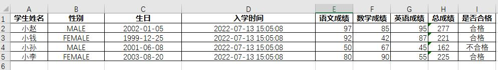
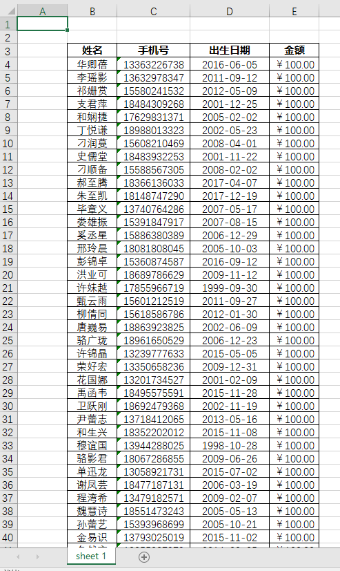

# excel-io

封装poi对Office Excel的输入输出工具，简化简单的导入和导出Excel数据的操作。（暂不支持合并单元格）

```xml
<dependency>
    <groupId>com.github.developframework</groupId>
    <artifactId>excel-io</artifactId>
</dependency>
```

## 教程

假设存在实体`Student`包装数据（构造方法略）

```java
public class Student {

    // 姓名
    private String name;

    // 性别
    private Gender gender;

    // 生日
    private LocalDate birthday;

    // 入学时间
    private LocalDateTime createTime;

    // 语文成绩
    private int chineseScore;

    // 数学成绩
    private int mathScore;

    // 英语成绩
    private int englishScore;

    // 总成绩
    private int totalScore;

    // 是否合格
    private Boolean qualified;

    public enum Gender {

        MALE, FEMALE
    }
}
```

```java
List<Student> students=List.of(
        new Student("小赵",Student.Gender.MALE,LocalDate.of(2002,1,5),LocalDateTime.now(),97,85,95),
        new Student("小钱",Student.Gender.FEMALE,LocalDate.of(1999,12,25),LocalDateTime.now(),92,89,87),
        new Student("小孙",Student.Gender.MALE,LocalDate.of(2001,6,8),LocalDateTime.now(),50,40,45),
        new Student("小李",Student.Gender.FEMALE,LocalDate.of(2003,8,20),LocalDateTime.now(),80,90,72)
        );
```

### ExcelIO

使用`ExcelIO`得到输入输出处理器

#### 写出数据到Excel

```java
List<Student> students=new LinkedList<>();
// 准备数据略
        File file=ExcelIO
        .writer(ExcelType.XLSX)
        .load(students,(workbook,builder)->
        builder.columnDefinitions(
        builder.<Student, String>column("name","学生姓名"),
        builder.<Student, Student.Gender>column("gender","性别"),
        builder.<Student, LocalDate>column("birthday","生日"),
        builder.<Student, LocalDateTime>column("createTime","入学时间"),
        builder.<Student, LocalDate>column("chineseScore","语文成绩"),
        builder.<Student, LocalDate>column("mathScore","数学成绩"),
        builder.<Student, LocalDate>column("englishScore","英语成绩"),
        builder.<Student, Integer>formula("总成绩","SUM(E{row}:G{row})"),
        builder.<Student, String>formula("是否合格","=IF(H{row} >= 180,\"合格\",\"不合格\")")
        )
        )
        .writeToFile("D:\\学生成绩表.xlsx");
```



#### 从Excel读取数据

使用`excel-io`导入students数据

```java


```



### TableDefinition

该接口是表格的定义类，一个定义类代表了一个数据表

通过该接口可以设置表格的表头信息和表格的左上角单元格位置（工作表、行、列）。

| 可实现方法                                           | 说明                    | 默认值 |
| ---------------------------------------------------- | ----------------------- | ------ |
| hasTitle()                                           | 表格顶部是否含有标题    | false  |
| title()                                              | 标题文本                | null   |
| hasColumnHeader()                                    | 是否有列说明            | true   |
| sheetName()                                          | 工作表名称              | null   |
| tableLocation()                                      | 表格位置(起始行,起始列) | null   |
| columnDefinitions(Workbook, ColumnDefinitionBuilder) | 列定义                  | 未实现 |
| sheetExtraHandler()                                  | 工作表其它扩展处理      | null   |

### ColumnDefinition

该抽象类是表格的列定义类，一个定义类代表了表中的某一列，指代了一个字段
