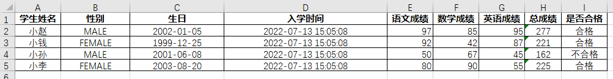
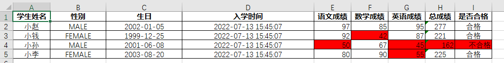
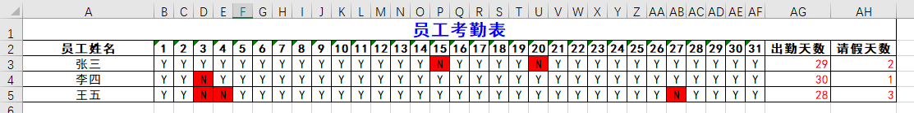

# excel-io

封装poi对Office Excel的输入输出工具，简化简单的导入和导出Excel数据的操作。（暂不支持合并单元格）

```xml
<dependency>
    <groupId>com.github.developframework</groupId>
    <artifactId>excel-io</artifactId>
</dependency>
```

## 教程

假设存在实体`Student`包装数据（构造方法略）

```java
public class Student {

    // 姓名
    private String name;

    // 性别
    private Gender gender;

    // 生日
    private LocalDate birthday;

    // 入学时间
    private LocalDateTime createTime;

    // 语文成绩
    private int chineseScore;

    // 数学成绩
    private int mathScore;

    // 英语成绩
    private int englishScore;

    // 总成绩
    private int totalScore;

    // 是否合格
    private Boolean qualified;

    public enum Gender {

        MALE, FEMALE
    }
}
```

```java
List<Student> students=List.of(
        new Student("小赵",Student.Gender.MALE,LocalDate.of(2002,1,5),LocalDateTime.now(),97,85,95),
        new Student("小钱",Student.Gender.FEMALE,LocalDate.of(1999,12,25),LocalDateTime.now(),92,89,87),
        new Student("小孙",Student.Gender.MALE,LocalDate.of(2001,6,8),LocalDateTime.now(),50,40,45),
        new Student("小李",Student.Gender.FEMALE,LocalDate.of(2003,8,20),LocalDateTime.now(),80,90,72)
);
```

### ExcelIO

使用`ExcelIO`得到输入输出处理器

#### 写出数据到Excel

```java
List<Student> students=new LinkedList<>();
// 准备数据略
File file = ExcelIO
    .writer(ExcelType.XLSX)
    .load(students,(workbook,builder)->
        builder.columnDefinitions(
            builder.<String>column("name","学生姓名"),
            builder.<Student.Gender>column("gender","性别"),
            builder.<LocalDate>column("birthday","生日"),
            builder.<LocalDateTime>column("createTime","入学时间"),
            builder.<Integer>column("chineseScore","语文成绩"),
            builder.<Integer>column("mathScore","数学成绩"),
            builder.<Integer>column("englishScore","英语成绩"),
            builder.<Integer>formula("总成绩","SUM(E{row}:G{row})"),
            builder.<Boolean>formula("是否合格","IF(H{row} >= 180,\"合格\",\"不合格\")")
        )
    )
    .writeToFile("D:\\学生成绩表.xlsx");
```



#### 从Excel读取数据

使用`excel-io`导入students数据

```java
final List<Student> students = ExcelIO
    .reader("D:\\学生成绩表.xlsx")
    .read(Student.class, (workbook, builder) ->
            builder.columnDefinitions(
                    builder.<String>column("name"),
                    builder.<Student.Gender>column("gender"),
                    builder.<LocalDate>column("birthday"),
                    builder.<LocalDateTime>column("createTime"),
                    builder.<Integer>column("chineseScore"),
                    builder.<Integer>column("mathScore"),
                    builder.<Integer>column("englishScore"),
                    builder.<Integer>formula(Integer.class, "totalScore"),
                    builder.<String>formula(String.class, "qualified")
                            .readConvert((student, qualified) -> qualified.equals("合格"))
            )
    );

```

读取时可以不设置列名`header`

### TableDefinition

该接口是表格的定义类，一个定义类代表了一个数据表

通过该接口可以设置表格的表头信息和表格的左上角单元格位置（工作表、行、列）。

```java
new TableDefinition<>() {

    /**
     * 设置表格信息
     */
    @Override
    public TableInfo tableInfo() {
        return new TableInfo();
    }

    /**
     * 列定义
     */
    @Override
    public ColumnDefinition<Student>[] columnDefinitions(Workbook workbook, ColumnDefinitionBuilder builder) {
        return builder.columnDefinitions(
                
        );
    }

    /**
     * 全局单元格样式处理
     */
    @Override
    public BiConsumer<Workbook, CellStyle> globalCellStylesHandle() {
        return null;
    }

    /**
     * 申明自定义单元格样式
     */
    @Override
    public Map<String, CellStyle> customCellStyles(Workbook workbook) {
        return Collections.emptyMap();
    }

    /**
     * 工作表扩展处理
     */
    @Override
    public SheetExtraHandler<?> sheetExtraHandler() {
        return null;
    }

    /**
     * 装填完的实体单独处理
     */
    @Override
    public void each(Student student) {
        
    }
};

```

### ColumnDefinition

该抽象类是表格的列定义类，一个定义类代表了表中的某一列，指代了一个字段
可通过ColumnDefinitionBuilder方便创建ColumnDefinition的实例

```java

@Override
public ColumnDefinition<Student>[] columnDefinitions(Workbook workbook, ColumnDefinitionBuilder<Student> builder) {
    return builder.columnDefinitions(
        builder.columnDefinitions(
            builder
                .<Student /*实体泛型*/, String /*字段泛型*/>column("name", "学生姓名")
                // 写转化值
                .writeConvert((student, field) -> /* 处理逻辑 */)
                // 读转化值
                .readConvert((student, field) -> /* 处理逻辑 */)
                // 手动设置列宽
                .columnWidth(20)
                // 获得样式键 （可以针对单元格值来选择样式）
                .cellStyleKey((cell, cellValue) -> /* 获得样式键 */)
        )
    );
}
```

+ `builder.column(...)`声明一个普通列
+ `builder.literal(...)`声明一个字面量列
+ `builder.blank(...)`声明一个空列
+ `builder.formula(...)`声明一个公式列

如果上述快捷写法无法满足场景要求，需要更加灵活的写入和读取方式。可以直接实现`ColumnDefinition`接口

```java
@Override
public ColumnDefinition<Student>[] columnDefinitions(Workbook workbook, ColumnDefinitionBuilder builder) {
    return builder.columnDefinitions(
        new ColumnDefinition<>() {

            /**
             * 列信息
             */
            @Override
            public ColumnInfo getColumnInfo() {
                return new ColumnInfo("name", "学生姓名", 10);
            }
            
            /**
             * 描述如何把值写入单元格
             */
            @Override
            public Object writeIntoCell(Workbook workbook, Cell cell, Student student) {
                final String name = student.getName();
                cell.setCellValue(name);
                return name;
            }
            
            /**
             * 描述如何从单元格读取值并装填到实体
             */
            @Override
            public void readOutCell(Workbook workbook, Cell cell, Student student) {
                final String name = cell.getStringCellValue();
                student.setName(name);
            }
            
            /**
             * 配置单元格格式
             */
            @Override
            public void configureCellStyle(Cell cell, CellStyleManager cellStyleManager, Student entity, Object value) {
                cell.setCellStyle(cellStyleManager.getCellStyle(DefaultCellStyles.STYLE_NORMAL));
            }
        }
    );
}
```

### 功能

#### 配置单元格样式

##### 单元格样式管理器

> 在poi中创建CellStyle的个数是有限制的，xls上限4000个，xlsx上限64000个
> 
> 如果超限了会报如下两个异常：
> 
> The maximum number of cell styles was exceeded.You can define up to 4000 styles in a .xls workbook
> 
> The maximum number of Cell Styles was exceeded. You can define up to 64000 style in a .xlsx Workbook

所以提供`CellStyleManager`单元格样式管理器来管理申明的样式，做到复用CellStyle对象

##### 单元格样式键

用于在`CellStyleManager`内选取CellStyle的键，可以是自定义的任意字符串。也可以是一个特定结构的字符串用于描述CellStyle的特性（格式类似于层叠样式CSS），预设有如下写法：

+ **align 对齐**

```
align {vertical: right; horizontal: center}
可缩写成 a {v: right; h: center}
```

+ **border 边框**

```
border {style: thin; color: #ff0000}
可缩写成 b {style: thin; color: RED}
```

+ **dataFormat 格式**

```
dataFormat {format: 0.00%}
dataFormat {format: 'yyyy-mm-dd hh:mm:ss'}   如果格式中需要包含空格，需要加单引号
可缩写成 df {format: 'yyyy-mm-dd hh:mm:ss'}
```

+ **font 字体**

```
font {size: 16; bold: true; italic: true; family: '宋体'; color: #ff0000}
可缩写成 f {size: 16; bold; italic; family: '宋体'; color: #ff0000}  boolean字段是true的话可以缩写
```

+ **foreground 前景色**

```
foreground {color: #aa1199; type: SOLID_FOREGROUND}
可缩写成 fg {color: #aa1199; type: SOLID_FOREGROUND}
```

+ **config 其他配置**

```
config {wrapText: true} 允许单元格内换行
可缩写成 c {wrapText}
```

可在cellStyleKey()方法内直接使用

```java
builder
        .column(...)
    	// 结合文本块功能写起来更美观
        .cellStyleKey((cell, entity, cellValue) -> """
            a {
                h: right
            }
            font {
                color: #ffff00;
                size: 20
            }
            """;
        )
```

##### 默认单元格样式键

预设了默认的单元格样式：

| 默认单元格样式键                                    | 样式键                                                | 说明                 | 备注         |
| --------------------------------------------------- | ----------------------------------------------------- | -------------------- | ------------ |
| **DefaultCellStyles.STYLE_TITLE**                   | font {size: 16; bold}                                 | 加粗 16号字          | 标题采用     |
| **DefaultCellStyles.STYLE_HEADER**                  | font {bold}                                           | 加粗                 | 列头采用     |
| **DefaultCellStyles.STYLE_BODY**                    | <空字符串>                                            | 黑色细线边框文字居中 | 表格内容采用 |
| **DefaultCellStyles.STYLE_BODY_BOLD**               | font {bold}                                           | 加粗                 |              |
| **DefaultCellStyles.STYLE_BODY_ITALIC**             | font {italic}                                         | 斜体                 |              |
| **DefaultCellStyles.STYLE_BODY_PERCENT**            | dataFormat {format: '0.00%'}                          | 0.00% 百分比格式     |              |
| **DefaultCellStyles.STYLE_BODY_DATETIME**           | dataFormat {format: 'yyyy-mm-dd hh:mm:ss'}            | 日期时间格式         |              |
| **DefaultCellStyles.STYLE_BODY_DATE**               | dataFormat {format: 'yyyy-mm-dd'}                     | 日期格式             |              |
| **DefaultCellStyles.STYLE_BODY_TIME**               | dataFormat {format: 'hh:mm:ss'}                       | 时间格式             |              |
| **DefaultCellStyles.STYLE_BODY_NUMBER**             | align {horizontal: RIGHT}                             | 文字居右             |              |
| **DefaultCellStyles.STYLE_BODY_NUMBER_2_PRECISION** | align {horizontal: RIGHT} dataFormat {format: '0.00'} | 精度2 文字居右       |              |

```java
cell.setCellStyle(cellStyleManager.getCellStyle(DefaultCellStyles.STYLE_BODY));
```

##### 自定义单元格样式

可以用于覆盖默认单元格样式，也可初始化自定义样式

```java
new TableDefinition<>() {
    /**
     * 申明自定义单元格样式
     */
    @Override
    public Map<String, CellStyle> customCellStyles(Workbook workbook) {
        // final CellStyle cellStyle = workbook.createCellStyle();
        final CellStyle cellStyle = DefaultCellStyles.buildByCellStyleKey(DefaultCellStyles.STYLE_BODY);
        // 对单元格样式做自定义配置
        cellStyle.setDataFormat(...);
        // 如果选择默认样式的键将会覆盖
        return Map.of(DefaultCellStyles.STYLE_BODY, cellStyle);
    }
}
```

单元格可以根据值来判定选择哪个样式键

```java
builder
        .column(...)
        // 获得样式键 （可以针对单元格值来选择样式）
        .cellStyleKey((cell, entity, cellValue) -> {
            return cellValue == null ? DefaultCellStyles.STYLE_BODY : "customKey";
        })
```

示例：

依靠单元格的值，将不合格的分数标红色背景

```java
ExcelIO
    .writer(ExcelType.XLSX)
    .load(students, new TableDefinition<>() {

        @Override
        public Map<String, CellStyle> customCellStyles(Workbook workbook) {
            // 设置单元格背景色
            final CellStyle redCellStyle = DefaultCellStyles.buildByCellStyleKey("a {h: right} fg {color: RED}");
            return Map.of("redColor", redCellStyle);
        }

        @Override
        public ColumnDefinition<Student>[] columnDefinitions(Workbook workbook, ColumnDefinitionBuilder builder) {
            // 判定分数大于60
            final CellStyleKeyProvider<Student> scoreKeyProvider = (cell, e, v) -> ((Integer) v) >= 60 ? null : "redColor";
            // 判定分数大于180
            final CellStyleKeyProvider<Student> totalKeyProvider = (cell, e, v) -> ((Integer) v) >= 180 ? null : "redColor";
            // 判定是否合格
            final CellStyleKeyProvider<Student> qualifiedKeyProvider = (cell, e, v) -> v.equals("合格")? null : "redColor";
            return builder.columnDefinitions(
                builder.column("name", "学生姓名"),
                builder.column("gender", "性别"),
                builder.column("birthday", "生日"),
                builder.column("createTime", "入学时间"),
                builder.column("chineseScore", "语文成绩").cellStyleKey(scoreKeyFunction),
                builder.column("mathScore", "数学成绩").cellStyleKey(scoreKeyFunction),
                builder.column("englishScore", "英语成绩").cellStyleKey(scoreKeyFunction),
                builder.formula(Integer.class, "总成绩", "SUM(E{row}:G{row})").cellStyleKey(totalKeyFunction),
                builder.formula(String.class, "是否合格", "IF(H{row} >= 180,\"合格\",\"不合格\")").cellStyleKey(qualifiedKeyFunction)
            );
        }
    }
)
.writeToFile("D:\\学生成绩表.xlsx");
```



##### 全局单元格样式

对所有注册进单元格样式管理器的CellStyle执行统一处理

```java
new TableDefinition<>(){
    
    /**
     * 全局单元格样式处理
     */
    @Override
    public BiConsumer<Workbook, CellStyle> globalCellStylesHandle() {
        return (workbook, cellStyle) -> {
            // 改变全部字体
            final Font font = workbook.createFont();
            font.setFontName("宋体");
            cellStyle.setFont(font);
        };
    }
}
```

## Demo

制作员工考勤表

```java
@Getter
@Setter
public class StaffAttendance {

    // 员工姓名
    private String name;

    // 考勤记录
    private Attendance[] attendances;

    @Getter
    @RequiredArgsConstructor(access = AccessLevel.PRIVATE)
    public enum Attendance {
        // 出勤
        ON_DUTY("Y"),
		// 请假
        LEAVE("N");

        private final String text;
    }
}
```

```java
public static List<StaffAttendance> buildStaffAttendances() {
        return List.of(
                createStaffAttendance("张三", new int[]{15, 20}),
                createStaffAttendance("李四", new int[]{3}),
                createStaffAttendance("王五", new int[]{3, 4, 27})
        );
    }

private static StaffAttendance createStaffAttendance(String name, int[] leaveDays) {
    StaffAttendance staffAttendance = new StaffAttendance();
    staffAttendance.setName(name);
    final StaffAttendance.Attendance[] attendances = new StaffAttendance.Attendance[31];
    staffAttendance.setAttendances(attendances);
    Arrays.fill(attendances, StaffAttendance.Attendance.ON_DUTY);
    for (int leaveDay : leaveDays) {
        attendances[leaveDay - 1] = StaffAttendance.Attendance.LEAVE;
    }
    return staffAttendance;
}
```

```java
final List<StaffAttendance> projects = buildStaffAttendances();
        ExcelIO.writer(ExcelType.XLSX)
            .load(projects, new TableDefinition<>() {

                @Override
                public TableInfo tableInfo() {
                    TableInfo tableInfo = new TableInfo();
                    tableInfo.hasTitle = true;
                    tableInfo.title = "员工考勤表";
                    tableInfo.sheetName = "考勤表";
                    return tableInfo;
                }

                @Override
                public Map<String, CellStyle> customCellStyles(Workbook workbook) {
                    // 自定义标题样式 覆盖原有样式
                    final CellStyle titleCellStyle = DefaultCellStyles.buildByCellStyleKey(workbook, "font {size: 16; bold; color: BLUE}");
                    return Map.of(DefaultCellStyles.STYLE_TITLE, titleCellStyle);
                }

                @Override
                public BiConsumer<Workbook, CellStyle> globalCellStylesHandle() {
                    return (workbook, cellStyle) -> {
                        // 修改全局字体
                        final Font font = workbook.getFontAt(cellStyle.getFontIndexAsInt());
                        font.setFontName("黑体");
                    };
                }

                @Override
                @SuppressWarnings("unchecked")
                public ColumnDefinition<StaffAttendance>[] columnDefinitions(Workbook workbook, ColumnDefinitionBuilder<StaffAttendance> builder) {
                    List<ColumnDefinition<StaffAttendance>> columnDefinitions = new LinkedList<>();
                    columnDefinitions.add(
                        builder.column("name", "员工姓名").columnWidth(20)
                    );
                    for (int i = 0; i < 31; i++) {
                        columnDefinitions.add(
                            builder.<StaffAttendance.Attendance>column(String.format("attendances[%d]", i), String.valueOf(i + 1))
                            .writeConvert((e, v) -> v.getText())
                            // 把请假的标记为红色
                            .cellStyleKey((c, e, v) -> v.equals(StaffAttendance.Attendance.LEAVE.getText()) ? "fg {color: RED}" : null)
                            .columnWidth(3)
                        );
                    }

                    // 可以用工具类方便计算出列名
                    final String startColumnName = ColumnUtils.getColumnNameByIndex((short) 1); // B
                    final String endColumnName = ColumnUtils.getColumnNameByIndex((short) 31); // AF

                    // 居右的红色文字样式
                    final CellStyleKeyProvider<StaffAttendance> redRightProvider = (c, e, v) -> "a {h: right} f {color: #ff0000}";

                    // 使用函数进行统计 {row} 动态行数
                    columnDefinitions.add(
                        builder.formula(Integer.class, "出勤天数", String.format("=COUNTIF(%s{row}:%s{row},\"Y\")", startColumnName, endColumnName))
                        .cellStyleKey(redRightProvider).columnWidth(10)
                    );
                    columnDefinitions.add(
                        builder.formula(Integer.class, "请假天数", String.format("=COUNTIF(%s{row}:%s{row},\"N\")", startColumnName, endColumnName))
                        .cellStyleKey(redRightProvider).columnWidth(10)
                    );
                    return columnDefinitions.toArray(ColumnDefinition[]::new);
                }
            })
            .writeToFile("D:\\员工考勤表.xlsx");
```

